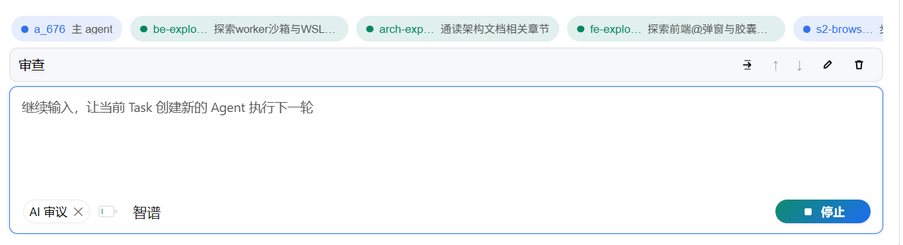

# Every Agent

> **An Agent you can use anywhere** — an open-source, self-hostable **remote AI agent control platform**: run AI tasks on your own PC, then check progress, continue the conversation, and answer its questions from a **phone, tablet, office computer, or any browser tab**.

<p align="center">
  
  
  
  
  
  
  
  
</p>

[简体中文](README.md) | **English**

**Every Agent** is a "reachable from anywhere, executing locally" AI agent system — in one sentence: **your own agent, usable anywhere**.

- ✅ **Open source · free · self-hosted**: all code, files, and data stay on your own computer, never passing through any third-party server. Ideal for privacy-conscious individual developers and small teams.
- ✅ **Remote control without a public IP**: no need to worry about NAT, routers, or public IPs — the worker only needs to make one **outbound WebSocket** encrypted long connection, and browsers from all over the world can remotely control it (phone, tablet, office computer, Electron desktop).
- ✅ **Multi-device sync, resumable playback**: close the browser and the task keeps running; reopen it and the full history from start to current is visible, streaming continues, nothing is lost.
- ✅ **Built-in safety guardrails**: commands run in a sandbox, out-of-bounds operations require popup authorization, optional **AI review / unattended** auto-adjudication.

**Tech keywords**: Spring Boot · Spring AI · Java 25 virtual threads · WebSocket · React · TypeScript · Electron · OpenAI-compatible models · model pool failover · multi-workspace · sub-agent orchestration.

---

## ✨ Highlights

### 🌍 Multi-device control — truly "usable anywhere"
- The worker runs on your **home/office PC** and connects to a public hub via an **outbound WebSocket** — no need to worry about NAT, routers, or public IPs.
- **Desktop / mobile native adaptation**: the frontend has dedicated responsive designs for desktop and mobile. The desktop browser is a full multi-column workbench; the mobile UI auto-collapses sidebars and adapts to touch (long-press gestures, safe areas, breakpoint layouts). The same frontend works smoothly on both screens.
- **One frontend, multiple workers**: one at home + one at the office, unified in a single frontend to switch and operate by owner; all online workers under the hub can be managed.
- **One worker, multiple registered hubs**: the `worker.hubs` list can simultaneously connect to a public hub + an intranet/backup hub; the same tasks and files are visible across hubs, providing mutual redundancy.
- When the AI needs your confirmation, the question pops up synchronously on **all online frontends** — answer from whichever device you're on.

### 🔒 Data never leaves your machine — dual-key authentication is safer
- The hub is a **pure relay**: it stores nothing, understands nothing — it doesn't even know what a "task" is; it just forwards frames as-is.
- Task logs, files, git credentials, and model configs are all stored on the worker's local machine (`~/.everyagent/`). Network outages or hub downtime don't affect tasks continuing to completion.
- **Two independent keys, each governing its own domain**: the hub key controls "connecting to the hub," and the worker apiKey controls "manipulating this worker's data" — the two keys are independent and isolated per worker; leaking one doesn't compromise the whole system.

### 📡 Resumable playback — progress is never lost
- Real-time task stream increments are **directly pushed** via the stream channel; history/backfill is pulled via `task.poll` — both from the same source, deduplicated by seq.
- Close the browser, switch Wi-Fi, restart the hub: after reconnection it auto-re-subscribes and pulls backfill, making everything **fully visible from start to current**, then continues streaming.
- Tasks are **permanently retained** and only disappear when you actively delete them.

### 🤖 Full AI visibility
- Watch **token-by-token output, thinking process, tool calls, and file changes** in real time.
- Conversations are collapsible by "rounds"; expand to lazily load process details. Sub-agents are shown as a tree; concurrent multi-agent sessions don't lose frames.
- Per-round token usage and context consumption are clear at a glance.

### 🛡️ Security sandbox + human-AI collaboration guardrails
- Commands run in a **sandbox**: on Windows it defaults to a WSL2 managed distribution (a disposable system that can be fully reinstalled); host drives **outside the workspace are invisible**. Network is allowed by default and can be disabled per-task via `/disable-network`.
- Out-of-workspace operations / dangerous commands always require **popup authorization** (reject / this round / this task), with optional **AI review** for auto-adjudication or **unattended mode** to run fully automatically.
- Git credentials are AES-GCM encrypted and stored locally, never transmitted over the network.

### 🔌 Plug in any model, with built-in failover
- Any **OpenAI-compatible** provider: OpenAI, DeepSeek, Qwen, GLM, local vLLM/Ollama… just change one line of config.
- **Model pool**: a task can be configured with multiple models; if the primary fails, it automatically switches to the next without interrupting the task.
- 💸 **A boon for free-model users**: the project was developed in its later stages entirely on **free models** — thanks to **SenseNova** for its generous free model quotas and to **OpenRouter** for its free model endpoints. Even when a free quota runs out or a model goes down, the model pool auto-switches to the next available one so development never stops. Today, Every Agent can **develop itself using Every Agent** (dogfooding).

### 🖥️ Desktop edition works out of the box
- Windows x64 **installer / portable edition**: bundles frontend + hub + worker + a slim JRE; double-click to use, no need to install Java / Node / Docker.

### 🧩 Four modules, freely combinable for deployment
The four modules — web / hub / worker / desktop — are **decoupled and each serves its purpose**. They can be built and deployed individually and combined freely:

- **Just want a single local machine** → use the desktop all-in-one bundle, ready out of the box.
- **Want public multi-device remote control** → run only hub + web on a public server, and run a worker separately on your own computer.
- **Worker is a first-class citizen** → one worker can register with **multiple hubs** simultaneously (`worker.hubs` list): connect to both a public hub and an intranet/backup hub; the same tasks and files are visible across hubs, providing mutual redundancy.
- **Desktop also supports multi-hub** → the worker bundled in the desktop edition is a full worker; configure multiple `worker.hubs` entries in `~/.everyagent/application-worker.yaml` to register this "desktop worker" to both a local hub and a remote public hub — "out-of-the-box single machine" and "remote control from anywhere" hold simultaneously.

> Tip: `worker.hubs` is a list and is **replaced as a whole** — to keep both local and remote entries in an override file, you must write both entries.

---

## 📸 Screenshots
- Web frontend (connected to the same worker)

- Desktop app (connected to the same worker)

- Desktop app (connected to the same worker)

- Mobile (connected to the same worker)


- Sub-agents and task queue


---

## 🏗️ Architecture Overview

```
[Home/Office LAN]                          [Public Server]
┌────────────────────┐   wss outbound conn   ┌──────────────────┐        ┌─────────────────┐
│  worker (your PC)  │ ═══════════════════> │  hub (pure relay, │ <══════ │  frontend (any  │
│  runs tasks + local│     one per hub      │   no storage)     │   wss   │   browser)      │
│  event log         │                      │                   │         │  phone/tablet/ │
└────────────────────┘                      └──────────────────┘        │  office computer │
                                                                          └─────────────────┘
```

| Module | Responsibility | Port |
|---|---|---|
| `every-agent-hub` | Public message hub: pure relay WebSocket, zero state, zero buffer, zero business logic | 9100 |
| `every-agent-worker` | Executor: Spring Boot + Spring AI 2, manages tasks/models/workspace/sandbox | 9200 (local health only) |
| `every-agent-web` | Frontend: React + TS, built-in TS client SDK, remotely controls worker via hub | 5174 (dev) |
| `every-agent-contract` | Pure protocol contract: frames/RPC envelopes/error codes/identity hashing (Java + TS) | — |
| `every-agent-desktop` | Electron desktop edition: bundles web + hub + worker (Windows x64) | local 9100/9200 |

**Deployment topology matrix** — four modules can be freely combined; three typical forms:

| Topology | Modules used | How to combine | Best for |
|---|---|---|---|
| 🖥️ **Single machine (out of the box)** | `desktop` (bundles web + hub + worker) | Install only the desktop edition; it auto-launches hub + worker + frontend locally | Personal local use, zero config, full-featured |
| 🌍 **Public remote (multi-device)** | Public server: `hub` + `web`; local: `worker` | Server runs hub + frontend static site; local worker connects outbound via wss to public hub | Remotely control your home computer from phone / anywhere, no public IP needed |
| 🔁 **Multi-hub redundancy (multi-device × redundancy)** | Local/desktop `worker` + two or more `hub`s | `worker.hubs` list registers both public hub and intranet/backup hub simultaneously; same task is visible across hubs, mutually redundant | High reliability, multi-network insurance; desktop's built-in worker also applies |

> Tip: `worker.hubs` is a list and is **replaced as a whole** — to keep both local and remote entries in an override file, you must write both entries.

> For detailed design, see **[docs/ARCHITECTURE.md](docs/ARCHITECTURE.md)** (the single source of truth for architecture: protocol, data model, security model, implementation red lines).

---

## 🚀 Quick Start

### Option 1: Desktop Edition (recommended — zero dependencies · zero config)

1. Download the Windows x64 **installer** (or **portable** edition) from Releases;
2. Install and launch — the desktop edition auto-starts the local hub + worker + frontend;
3. The frontend auto-connects to the local hub; no manual connection info needed, ready to use on first launch;
4. The only thing to do: fill in your model per "Configure Models (Desktop)" below, then create a task and start.

#### Configure models (desktop)

The desktop edition's data directory defaults to `~/.everyagent`. Create `~/.everyagent/application-worker.yaml` with any text editor:

```yaml
worker:
  models:
    - config-id: default
      provider: openai-compat
      base-url: https://api.openai.com/v1   # replace with your provider endpoint
      model: gpt-4o-mini
      api-key: sk-xxxx                      # your API key, stored locally only
      is-default: true
```

Save and **restart the desktop edition** (the worker loads model config at startup) to create tasks and start running.

> More config: multiple models, model pool failover, any OpenAI-compatible provider — see "Configure Models (Required)" below.

> 🎉 **Zero-config connection**: the desktop edition works out of the box; no need to manually create or modify any connection config file — when `~/.everyagent/desktop-config.json` doesn't exist, the program uses built-in defaults (local hubKey / workerApiKey / workerId and ports), the frontend auto-fills and connects locally. Only when you actually want to change local ports or custom credentials do you need to create this file to override the corresponding fields (hubKey / workerApiKey / workerId / hubPort / workerPort).

### Option 2: Docker (self-host hub + worker + web)

```bash
HUB_KEY=your-hub-key docker-compose up --build
```

- Hub: `ws://<host>:9100/ws` (health check `GET :9100/health`)
- Worker: inside the container it connects outbound to the hub; workspace/data is stored in named volumes
- Frontend: open `http://<host>:5174` in a browser, fill in the hub address and hub key in the Settings page to discover the worker; then fill in the worker's apiKey to remotely control its data

### Option 3: Build from source / development

```bash
# Java (requires JDK 25; Spring Boot 4.1 / Spring AI 2 are pinned by the root pom)
mvn -pl every-agent-hub spring-boot:run          # hub @ 9100
mvn -pl every-agent-worker spring-boot:run       # worker, connects outbound to hub

# Frontend
cd every-agent-web && npm install && npm run dev # http://localhost:5174
```

Tests: `mvn test` (contract + hub + worker full-chain E2E), `cd every-agent-web && npm run typecheck`.

---

## ⚙️ Configure Models (Required)

The worker calls models using the **OpenAI-compatible protocol**. Write the following to `~/.everyagent/application-worker.yaml` (desktop / local worker reads this file by default; for Docker deployment, mount a volume or inject environment variables):

```yaml
worker:
  models:
    - config-id: default
      provider: openai-compat   # any value other than model-pool works; model-pool = failover pool (see below)
      base-url: https://api.openai.com/v1   # replace with your provider endpoint
      model: gpt-4o-mini
      api-key: sk-xxxx          # your API key, stored locally only
      is-default: true
```

**Model pool failover** (optional): auto-switch when the primary model fails — especially friendly for "free-model users": the project was developed in its later stages on free models (SenseNova's many free models, OpenRouter's free endpoints, etc.), auto-switching when quotas run out or models are unavailable. Today, Every Agent is used to develop itself.

```yaml
    - config-id: failover
      provider: model-pool
      model: "default,qwen"     # comma-separated member configIds; first = primary
```

---

## 📱 Multi-Device Access (Core Scenario)

1. Deploy hub + frontend static site on a **public server** (see `docker-compose.yml` / `deploy.py`; production requires wss + TLS, LB WebSocket idle timeout ≥ 60s);
2. Run worker on your **home/office PC**; in `application-worker.yaml`, set `worker.hubs` `url` to point to the public hub (each entry needs `url + api-key + hub-key`; multi-hub redundancy supported);
3. Open the frontend on any device → fill in the hub address and hub key → select the worker and enter its apiKey → **see all tasks on your home computer**;
4. Start/view tasks from your phone, reply to AI questions, review authorization popups — exactly as if you were sitting in front of your home computer.

> Dual-key auth: the hub key controls "connecting to the hub," and the worker apiKey controls "manipulating this worker's data." Keys = identity; for public use, keep them safe and use wss.

---

## 🛠️ Common Configuration Quick Reference

| Config | Description |
|---|---|
| `worker.hubs[].url / api-key / hub-key` | The only entry point for worker-to-hub connection (multi-hub list); if not configured, the worker doesn't connect to any hub |
| `HUB_KEY` (env var) | Hub key in plaintext; if not set, the hub refuses to start (sha256 computed at startup) |
| `WORKER_ID` (env var) | Worker identity; the frontend addresses by this |
| `EVERYAGENT_HOME` | System directory (model config / default workspace / data), default `~/.everyagent` |
| `worker.sandbox.type` | `auto` (Windows defaults to wsl-direct) / `wsl-bwrap` / `windows-mic` / `none` |
| `worker.permissions.*` | Dangerous operation authorization, AI review timeout, etc. (see Architecture §7.8–§7.9) |

---

## 🧩 Capabilities Overview

- **Tasks**: permanently retained, run-and-destroy, cold-start resumption; input queue management (add/remove/reorder/insert into current conversation); slash commands and task-level toggles (model pool / AI review / unattended / network).
- **Sub-agents**: `run_agent` / `list_agents` / `wait_agents` / `stop_agent`; in-process nesting, context isolation, concurrent execution.
- **Files & git**: workspace file tree (lazy loading), read/write/move/delete, git status/log/diff/commit/pull/push/clone, encrypted credential storage.
- **Multi-workspace**: one worker manages multiple projects in parallel, tasks grouped by workspace.
- **Notifications**: task completion/errors, AI questions, authorization requests — browser and desktop system notifications.

---

## 📦 Tech Stack

| Layer | Technology |
|---|---|
| hub | Java 25 · Spring Boot WebFlux (Reactor Netty WS) |
| worker | Java 25 · Spring Boot · Spring AI 2 (ChatClient + Advisor) · virtual threads · JDK HttpClient WS |
| web | React · TypeScript (built-in TS client SDK) |
| desktop | Electron · electron-builder (NSIS + portable) |

Versions are uniformly pinned by the root pom; modules only depend on the pure protocol contract `every-agent-contract`.

---

## 📄 License

This project is licensed under the [Apache License 2.0](LICENSE), © 2026 Every Agent Contributors.

---

## 🙌 Contributing

Issues and PRs are welcome. Before starting, please read:

- [Contributing Guide](CONTRIBUTING.md): development environment, PR process, code and commit conventions;
- [Code of Conduct](CODE_OF_CONDUCT.md): community behavior expectations;
- [Security Policy](SECURITY.md): how to responsibly report vulnerabilities.

Development conventions: commit messages in Chinese, one commit per change; before making changes, please read the red-line checklist in [docs/ARCHITECTURE.md](docs/ARCHITECTURE.md) (especially Spring AI reuse, hub zero-business, disk as single source of truth, etc.).
