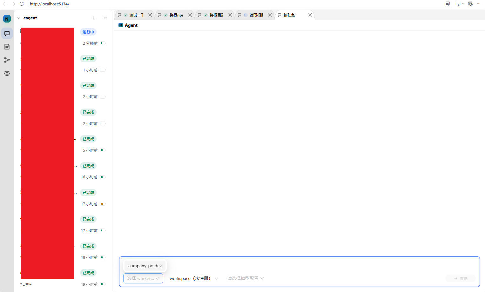
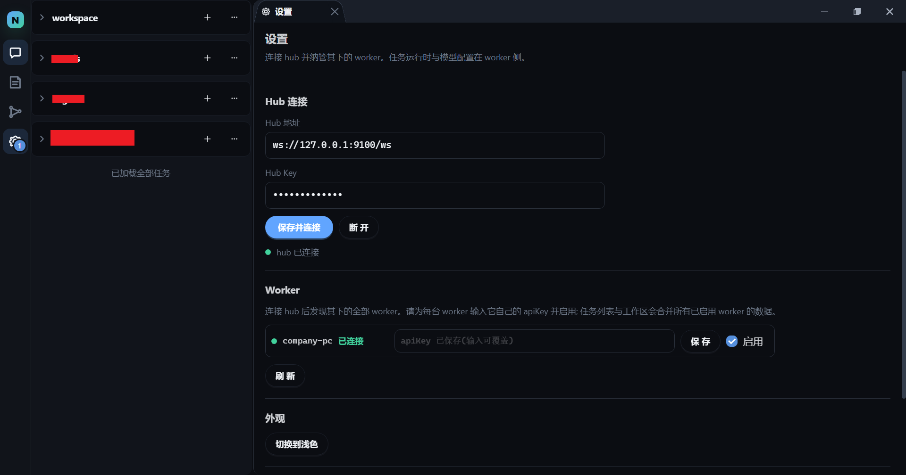
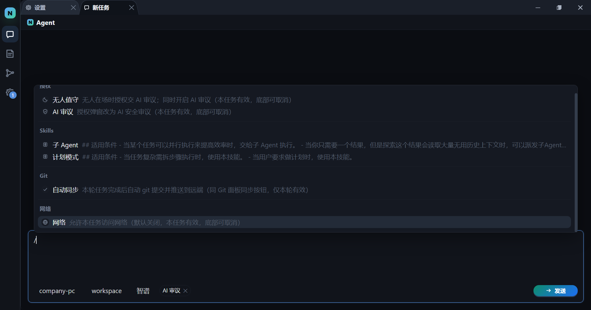
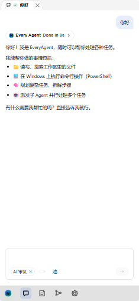

# Every Agent

> **哪里都可以使用的 Agent** —— 开源、可自托管(self-hosted)的**远程 AI Agent 控制平台**:让 AI 任务跑在你自己电脑上,然后用**手机、平板、办公室电脑、任何浏览器的标签页**随时查看进度、继续对话、回答它的提问。

<p align="center">
  
  
  
  
  
  
  
  
</p>

**Every Agent** 是一套「**公网可及、本机执行**」的 AI Agent 系统 —— 一句话:**自己的 Agent,哪里都能用**。

- ✅ **开源 · 免费 · 自托管(self-hosted)**:代码、文件、数据全部留在你自己的电脑上,不经过任何第三方服务器,适合重视隐私与数据主权的个人开发者和小团队;
- ✅ **远程控制,不需要公网 IP**:NAT、路由器、无公网 IP 都不用操心 —— worker 只需「打出去」一条 **WebSocket** 加密长连接,世界各地的浏览器都能遥控它(手机、平板、办公电脑、Electron 桌面版);
- ✅ **多端同步、断线续播**:关掉浏览器任务照跑,重开后从头到当前完整可见、继续流式输出,一次都没落下;
- ✅ **自带安全护栏**:命令在沙箱中执行、越界操作弹窗授权,可选 **AI 审议 / 无人值守**自动裁决。

**技术关键词**:Spring Boot · Spring AI · Java 25 虚拟线程 · WebSocket · React · TypeScript · Electron · OpenAI 兼容模型 · 模型池容灾 · 多工作区 · 子 Agent 编排。

> **English summary** — Every Agent is an open-source, self-hosted AI agent platform. Run AI tasks on your own PC and control them from any device (phone, tablet, or desktop browser) over an outbound WebSocket connection — no public IP, no port forwarding, and your data never leaves your machine. Highlights: remote multi-device control · NAT traversal · real-time streaming with resume · sandboxed execution · permission gating · AI safety review / unattended mode · OpenAI-compatible models with automatic failover · multi-workspace · sub-agent orchestration. **Free-model friendly**: the project itself was developed on free models — many thanks to SenseNova (商汤「日日新」) for its generous free model quotas and to OpenRouter for its free model endpoints; when a quota runs out or a model goes down, the model pool auto-fails-over to the next available one so development never stops. Today, Every Agent is used to develop Every Agent itself (dogfooding).

---

## ✨ 亮点

### 🌍 多端控制,真正的「哪里都可以用」
- worker 在**家中/办公室的 PC** 上运行,通过**出站 WebSocket** 连到公网 hub——NAT、路由器、无公网 IP 都不用操心;
- **桌面 / 手机原生适配**:前端对桌面端与移动端做了专门响应式设计——桌面浏览器是完整多栏工作台,手机端自动折叠侧栏、适配触屏(长按手势、安全区、断点布局),同一个前端在两块屏上都能顺手用;
- **一个前端,控制多台 worker**:家里一台 + 办公室一台,统一在一个前端里按归属切换、操作;hub 下所有在线 worker 都能管理;
- **一台 worker,注册多个 hub**:`worker.hubs` 列表可同时连公网 hub + 内网/备用 hub,同一份任务与文件多 hub 同步可见、互为冗余;
- AI 需要你确认时,会在**所有在线的前端**同步弹出问题,你在哪个端都能作答。

### 🔒 数据不出本机,双道鉴权更安全
- hub 只是**纯中转**,不落盘、不理解内容——它连"任务"是什么都不知道,只是原样转发帧;
- 任务日志、文件、git 凭证、模型配置全部存在 worker 本机(`~/.everyagent/`),断网、hub 宕机都不影响任务继续跑完;
- **两道独立密钥,各管一段**:hub key 管「连上 hub」,worker apiKey 管「动这台 worker 的数据」——两把 key 各自独立、按 worker 隔离,泄露一把不牵累全局。

### 📡 断线续播,永不丢进度
- 任务流实时增量经 stream 频道**定向推送**,历史/补齐经 `task.poll` 拉取——两路同源、按 seq 去重;
- 关浏览器、切 Wi-Fi、hub 重启:重连后自动重订阅 + 拉取补齐,**从头到当前完整可见**,并继续流式输出;
- 任务**永久保留**,只有你主动删除才会消失。

### 🤖 AI 全程可视化
- 实时看到**逐 token 输出、思考过程、工具调用、文件变更**;
- 对话按「轮次」折叠浏览,展开即懒加载过程细节;子 Agent 树状展示,多 agent 并发不丢帧;
- 每轮 token 用量、上下文占用一目了然。

### 🛡️ 安全沙箱 + 人机协作护栏
- 命令在**沙箱**中执行:Windows 默认走 WSL2 托管发行版(可整体重装的可丢弃系统),工作区之外的宿主盘**不可见**;网络默认关闭;
- 工作区外操作 / 危险命令一律先**弹窗授权**(拒绝 / 本轮 / 本任务三档),可开 **AI 审议**自动裁决,亦可开 **无人值守**全自动跑完;
- git 凭证 AES-GCM 加密存本机,不经网络传输。

### 🔌 模型随便换,自带容灾
- 任意 **OpenAI 兼容** provider:OpenAI、DeepSeek、Qwen、GLM、本地 vLLM/Ollama…改一行配置即可;
- **模型池**:一个任务可配置多个模型,主模型失败自动切换下一个,任务不中断;
- 💸 **白嫖党的福音**:项目后期就是靠**白嫖免费模型**开发出来的——感谢**商汤「日日新」(SenseNova)** 提供众多免费模型额度,以及 **OpenRouter** 开放的免费模型端点;就算免费额度用完、主模型罢工,模型池自动切换下一个还能用的,开发不中断。如今这个项目,已经能**用 Every Agent 自己开发 Every Agent** 了。

### 🖥️ 桌面版开箱即用
- Windows x64 **安装包 / 便携版**:内置前端 + hub + worker + 精简 JRE,双击即用,无需装 Java / Node / Docker。

### 🧩 四个模块,自由组合部署
web / hub / worker / desktop 四个模块**互相解耦、物尽其用**,可按需单独构建、单独部署、自由组合:

- **只想要本机单机** → 用 desktop 一体包,开箱即用;
- **想要公网多端远程** → 公网服务器只跑 hub + web,自己电脑上单独跑一个 worker;
- **worker 是一等公民** → 一个 worker 可同时注册到**多个 hub**(`worker.hubs` 列表):既连公网 hub 又连内网/备用 hub,同一份任务与文件在多个 hub 间同步可见,互为冗余;
- **desktop 也能多 hub** → 桌面版内置的 worker 是完整的 worker,在 `~/.everyagent/application-worker.yaml` 里配多个 `worker.hubs` 条目,即可把这份「桌面 worker」同时注册到本地 hub 和远端公网 hub——「开箱即用的单机」与「到哪都能遥控的远程」同步成立。

> 提示:`worker.hubs` 为列表且**整表替换**——覆盖文件里想同时保留本地与远端,需把两个条目都写上。

---

## 📸 界面预览
网页版前端（连着同一个worker）

桌面App（连着同一个worker）

桌面App（连着同一个worker）

移动端（连着同一个worker）


---

## 🏗️ 架构速览

```
[家中/办公室 LAN]                          [公网服务器]
┌────────────────────┐   wss 出站长连接    ┌──────────────────┐        ┌─────────────────┐
│  worker(个人 PC)    │ ═════════════════> │  hub(纯中转,不落盘) │ <══════ │  前端(任意浏览器) │
│  跑任务 + 本地事件日志 │     每 hub 一条     │                  │   wss   │  手机/平板/办公电脑 │
└────────────────────┘                    └──────────────────┘        └─────────────────┘
```

| 模块 | 职责 | 端口 |
|---|---|---|
| `every-agent-hub` | 公网消息中心:纯中转 WebSocket,零状态、零缓冲、零业务逻辑 | 9100 |
| `every-agent-worker` | 执行器:Spring Boot + Spring AI 2,托管任务/模型/workspace/沙箱 | 9200(仅本地健康) |
| `every-agent-web` | 前端:React + TS,内置 TS 客户端 SDK,经 hub 遥控 worker | 5174(dev) |
| `every-agent-contract` | 纯协议契约:帧/RPC 信封/错误码/身份哈希(Java + TS) | — |
| `every-agent-desktop` | Electron 桌面版:web + hub + worker 一体打包(Windows x64) | 本地 9100/9200 |

**部署拓扑矩阵** —— 四模块可自由组合,三种典型形态:

| 拓扑 | 用到哪些模块 | 怎么组合 | 适合场景 |
|---|---|---|---|
| 🖥️ **单机(开箱即用)** | `desktop`(内置 web + hub + worker) | 只装一个桌面版,本地自动拉起 hub + worker + 前端 | 个人本机使用,零配置、全功能 |
| 🌍 **公网远程(多端)** | 公网服务器:`hub` + `web`;本机:`worker` | 服务器跑 hub + 前端静态站;本机 worker 出站 wss 连公网 hub | 手机 / 异地随时遥控家中电脑,无需公网 IP |
| 🔁 **多 hub 冗余(多端 × 冗余)** | 本机/桌面 `worker` + 两个及以上 `hub` | `worker.hubs` 列表同时注册公网 hub + 内网/备用 hub;同一任务多 hub 同步可见,互为冗余 | 可靠性要求高、多网络双保险;desktop 内置 worker 同样适用 |

> 提示:`worker.hubs` 为列表且**整表替换**——覆盖文件里想同时保留本地与远端,需把两个条目都写上。

> 详细设计见 **[docs/ARCHITECTURE.md](docs/ARCHITECTURE.md)**(唯一架构事实源,协议、数据模型、安全模型、实现红线)。

---

## 🚀 快速开始

### 方式一:桌面版(推荐,零依赖 · 零配置)

1. 从 Releases 下载 Windows x64 **安装包**(或 **portable 便携版**);
2. 安装并启动 —— 桌面版自动拉起本地 hub + worker + 前端;
3. 前端已自动连上本地 hub,无需手动填写任何连接信息,首次启动即可用;
4. 唯一要做的:按下面「桌面版配置模型」填入你的模型,然后新建任务开跑。

#### 桌面版配置模型

桌面版数据目录缺省为 `~/.everyagent`。用任意文本编辑器新建 `~/.everyagent/application-worker.yaml`,填入:

```yaml
worker:
  models:
    - config-id: default
      provider: openai-compat
      base-url: https://api.openai.com/v1   # 换成你的 provider 端点
      model: gpt-4o-mini
      api-key: sk-xxxx                      # 你的 API key,只存本机
      is-default: true
```

保存后**重启桌面版**(worker 启动时加载模型配置)即可新建任务开跑。

> 更多配置:多模型、模型池容灾、任意 OpenAI 兼容 provider 见下文「配置模型(必需)」。

> 🎉 **连接零配置**:桌面版开箱即用,无需手动创建或修改任何连接配置文件——`~/.everyagent/desktop-config.json` 不存在时程序直接使用内置默认值(本地 hubKey / workerApiKey / workerId 与端口),前端自动填好并连上本地,装完即用。只有当你确实想换本地端口或自定义凭证时,才需要新建该文件覆盖对应字段 (hubKey / workerApiKey / workerId / hubPort / workerPort)。

### 方式二:Docker(自己托管 hub + worker + web)

```bash
HUB_KEY=你的hub密钥 docker-compose up --build
```

- hub:`ws://<主机>:9100/ws`(健康检查 `GET :9100/health`)
- worker:容器内出站连 hub,workspace/数据落在 named volume
- 前端:浏览器打开 `http://<主机>:5174`,在「设置」页填 hub 地址与 hub key 即可发现 worker;再填 worker 的 apiKey 才能遥控其数据

### 方式三:源码构建 / 开发

```bash
# Java 部分(需 JDK 25,Spring Boot 4.1 / Spring AI 2 由根 pom 锁定)
mvn -pl every-agent-hub spring-boot:run          # hub @ 9100
mvn -pl every-agent-worker spring-boot:run       # worker,出站连 hub

# 前端
cd every-agent-web && npm install && npm run dev # http://localhost:5174
```

测试:`mvn test`(contract + hub + worker 全链路 E2E)、`cd every-agent-web && npm run typecheck`。

---

## ⚙️ 配置模型(必需)

worker 按 **OpenAI 兼容协议**调用模型。把下面内容写入 `~/.everyagent/application-worker.yaml`(桌面版 / 本地 worker 默认读这个文件;Docker 部署请挂载或注入环境变量):

```yaml
worker:
  models:
    - config-id: default
      provider: openai-compat   # 任意非 model-pool 值均可;model-pool = 容灾池(见下)
      base-url: https://api.openai.com/v1   # 换成你的 provider 端点
      model: gpt-4o-mini
      api-key: sk-xxxx          # 你的 API key,只存本机
      is-default: true
```

**模型池容灾**(可选):主模型失败自动切换 —— 这对「白嫖党」尤其友好:本项目后期正是靠白嫖免费模型(**商汤「日日新」SenseNova** 的众多免费模型、**OpenRouter** 的免费端点等)开发出来的,额度用完或模型不可用时自动切换,开发不中断;后期已完全使用 Every Agent 自己来开发自己。

```yaml
    - config-id: failover
      provider: model-pool
      model: "default,qwen"     # 逗号分隔的成员 configId,首个 = 主模型
```

---

## 📱 多端访问(核心场景)

1. **公网服务器**上部署 hub + 前端静态站(见 `docker-compose.yml` / `deploy.py`;生产强制 wss + TLS,LB 的 WS 空闲超时 ≥ 60s);
2. **家里/办公室的 PC** 上运行 worker,在 `application-worker.yaml` 的 `worker.hubs` 里把 `url` 指向公网 hub(每项 `url + api-key + hub-key` 必填,支持多 hub 冗余);
3. 任何设备打开前端 → 填 hub 地址与 hub key → 选择 worker 填入其 apiKey → **看到家中电脑上的全部任务**;
4. 手机端发起/查看任务、回复 AI 提问、审阅授权弹窗——和坐在家里电脑前完全一样。

> 双道鉴权:hub key 管「连上 hub」,worker apiKey 管「动这台 worker 的数据」。密钥 = 身份,公网使用务必妥善保管并走 wss。

---

## 🛠️ 常用配置速查

| 配置 | 说明 |
|---|---|
| `worker.hubs[].url / api-key / hub-key` | worker 连 hub 的唯一入口(多 hub 列表);不配置则 worker 不连任何 hub |
| `HUB_KEY`(环境变量) | hub key 原文,未配置 hub 拒绝启动(启动时自算 sha256) |
| `WORKER_ID`(环境变量) | worker 身份,前端按此寻址 |
| `EVERYAGENT_HOME` | 系统目录(模型配置/默认工作区/数据),默认 `~/.everyagent` |
| `worker.sandbox.type` | `auto`(Windows 默认 wsl-direct) / `wsl-bwrap` / `windows-mic` / `none` |
| `worker.permissions.*` | 危险操作授权、AI 审议超时等(见架构文档 §7.8–§7.9) |

---

## 🧩 能力一览

- **任务**:永久保留、运行即销毁、冷启动续跑;输入队列管理(增删/重排/插入到当前对话);斜杠命令与任务级开关(模型池 / AI 审议 / 无人值守 / 网络);
- **子 Agent**:`run_agent` / `list_agents` / `wait_agents` / `stop_agent`,进程内嵌套、上下文隔离、并发运行;
- **文件与 git**:工作区文件树(懒加载)、读写/移动/删除、git status/log/diff/commit/pull/push/clone、凭证加密保存;
- **多工作区**:一台 worker 并行管理多个项目,任务按工作区分组;
- **通知**:任务完成/错误、AI 提问、授权请求,浏览器与桌面系统通知。

---

## 📦 技术栈

| 层 | 技术 |
|---|---|
| hub | Java 25 · Spring Boot WebFlux(Reactor Netty WS) |
| worker | Java 25 · Spring Boot · Spring AI 2(ChatClient + Advisor) · 虚拟线程 · JDK HttpClient WS |
| web | React · TypeScript(内置 TS 客户端 SDK) |
| desktop | Electron · electron-builder(NSIS + portable) |

版本统一由根 pom 锁定,模块间只依赖 `every-agent-contract` 纯协议契约。

---

## 📄 License

本项目采用 [Apache License 2.0](LICENSE) 开源协议,© 2026 Every Agent Contributors。

---

## 🙌 参与贡献

欢迎提交 Issue / PR。开始前请先阅读:

- [贡献指南](CONTRIBUTING.md):开发环境、PR 流程、代码与提交规范;
- [行为准则](CODE_OF_CONDUCT.md):社区行为约定;
- [安全政策](SECURITY.md):如何负责任地报告漏洞。

开发约定:提交信息用中文、一次一事;改动前请先阅读 [docs/ARCHITECTURE.md](docs/ARCHITECTURE.md) 的红线清单(尤其 Spring AI 复用、hub 零业务、磁盘唯一事实源等约束)。
